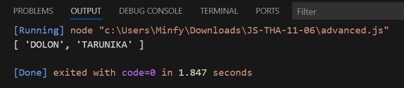

# Take Home Assignment

## Part 1: Basics & Variables

### 1. Declare a variable named favoriteFood using const and assign it a string value of your favorite food. Print it to the console.
```js
const favoriteFood = "Rajma Chawal";
console.log(favoriteFood);
```

### 2. Create two variables, numA and numB, and assign them number values. Write an if/else statement to print which number is larger or if they are equal.
```js
let numA = 73;
let numB = 87;

if(numA > numB){
    console.log("numA is larger");
} else if(numB > numA){
    console.log("numB is larger");
} else {
    console.log("Both are equal");
}
```

### 3. Write a for loop that prints the numbers from 1 to 20. For multiples of 3, print "Fizz" instead of the number. For multiples of 5, print "Buzz". For numbers which are multiples of both 3 and 5, print "FizzBuzz".
```js
for(let number = 1; number <= 20; number++) {
    if(number % 3 === 0 && number % 5 === 0){
        console.log("FizzBuzz");
    } else if(number % 3 === 0){
        console.log("Fizz");
    } else if(number % 5 === 0){
        console.log("Buzz");
    } else{
        console.log(number);
    }
}
```

#### All three output:


---

## Part 2: Arrays

### 1. Create an array named colors with three of your favorite colors.
   - Add a fourth color to the end of the array.
   - Add a new color to the beginning of the array.
   - Print the final array to the console.
```js
let colors = ["Red", "Blue", "Yellow"];
colors.push("Sky Blue");
colors.unshift("Purple");
console.log(colors);
```

### 2. Given the array let numbers = [10, 20, 30, 40, 50];, use the map method to create a new array where each number is increased by 5.
```js
let numbers = [10, 20, 30, 40, 50];
let increasedNumbers = numbers.map(function(number){
    return number + 5;
});
console.log(increasedNumbers);
```

### 3. Given the array let scores = [25, 80, 45, 95, 60, 75];, use the filter method to create a new array containing only the scores that are 70 or higher.
```js
let scores = [25, 80, 45, 95, 60, 75];
let higherScores = scores.filter(function(score){
    return score >= 70;
});
console.log(higherScores);
```

### 4. Use the reduce method on the scores array from the previous question to calculate the average score. (Hint: sum all scores and then divide by the number of scores).
```js
let scoress = [25, 80, 45, 95, 60, 75];
let totalScore = scoress.reduce(function(sum, score){
    return sum + score;
}, 0);
let averageScore = totalScore / scoress.length;
console.log(averageScore);
```

#### All four output:


---

## Part 3: Objects & Functions

### 1. Create an object named movie with properties for title, director, and releaseYear. Print the title of the movie to the console.
```js
let movie = {
    title: "Housefull 5",
    director: "Tarun Mansukhani",
    releaseYear: 2025
};
console.log(movie.title);
```

### 2. Write a function called printUserDetails that takes a user object as an argument. The user object will have name, email, and age properties. The function should use object destructuring in its parameters to print a string like: "User's name is [NAME], and they are [AGE] years old."
```js
function printUserDetails({name, age}) {
    console.log(`User's name is ${name}, and they are ${age} years old.`);
}

let user = {
    name: "Dolon",
    email: "dolon1234@gmail.com",
    age: 22
};

printUserDetails(user);
```

### 3. Create an array of user objects. Each object should have an id and a username. Use the find method to find the user with a specific id.
```js
let users = [
    {id: 1, userName: "dolon"},
    {id: 2, userName: "sahaved"},
    {id: 3, userName: "dheemanth"},
    {id: 4, userName: "aditya"},
    {id: 5, userName: "aryan"}
];

let findUser = users.find(function(user){
    return user.id === 1;
});
console.log(findUser);
```

#### All three output:


---

## Part 4: Putting It All Together (Advanced)

### 1. Write a function called getHighAchievers. This function should accept two arguments: an array of student objects and a passingScore number. Each student object will look like this: { id: 1, name: 'Alice', score: 85 }.
   - The function should filter the students to get only those with a score greater than or equal to passingScore.
   - It should then use map to return a new array containing only the names of the high-achieving students, in all
    uppercase letters.
   - Example: getHighAchievers(students, 80) might return ["ALICE", "BOB"].
```js
const student = [
    {id: 1, name: 'Dolon', score: 96},
    {id: 2, name: 'Aditya', score: 68},
    {id: 3, name: 'Sahaved', score: 45},
    {id: 4, name: 'Dheemanth', score: 30},
    {id: 5, name: 'Sameer', score: 14},
    {id: 6, name: 'Tarunika', score: 82}
];

function getHighAchievers(student, passingScore){
    return student.filter(student => student.score >= passingScore).map(student => student.name.toUpperCase());
}

const highAchievers = getHighAchievers(student, 80);
console.log(highAchievers);
```

#### Output:
